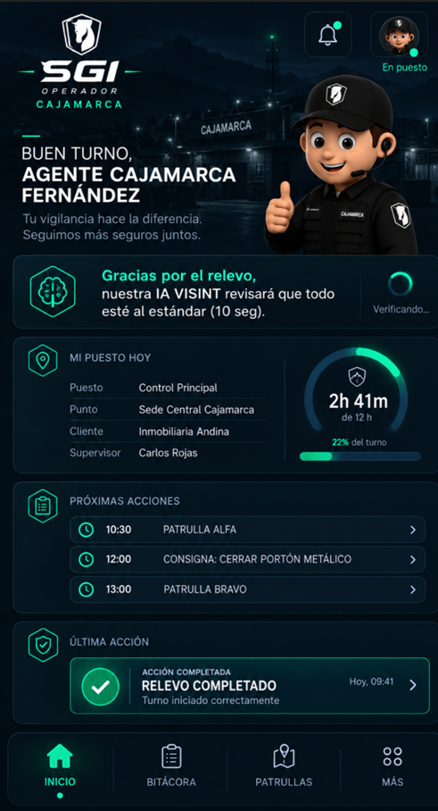
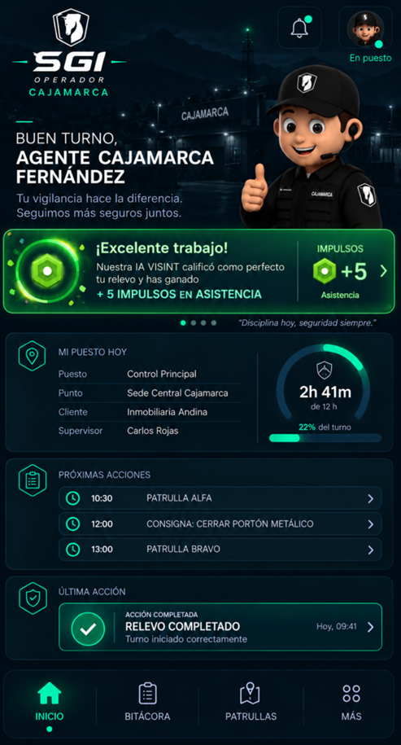

# SGI: Operador → SGI: Comando → VISINT → Impulsos

> **Estado de implementación (2026-09-30):** la validación visual de Hitos de patrulla está implementada y probada contra el VISINT real (foto del agente vs 1–5 fotos estándar, vía `POST /v1/evidence/validate`). Impulsos sigue sin implementar. Ver `docs/VISINT_ESTADO_IMPLEMENTACION.md`.

**Estado:** definición funcional/arquitectónica aprobada para incorporación al handoff de SGI: Comando.  
**Fecha:** 2026-09-20.  
**Alcance de este documento:** orquestación de evidencia visual y premiación con Impulsos. No modifica la UI congelada de SGI: Comando.

## 1. Objetivo

Cuando un Agente de Seguridad o Supervisor completa una tarea en **SGI: Operador** y esa tarea requiere evidencia fotográfica, las fotografías no se envían directamente desde SGI: Operador a VISINT. El flujo canónico pasa por **SGI: Comando**.

SGI: Comando tiene dos responsabilidades distintas:

1. **Orquestación de validación visual:** recibe la ejecución/evidencia desde SGI: Operador, la correlaciona con la tarea y la envía a VISINT para evaluación.
2. **Motor de Impulsos:** una vez recibido el resultado de VISINT, SGI: Comando obtiene/aplica la versión vigente de las reglas de gamificación definidas por **CORE** (habilidad, elegibilidad, probabilidad, cantidad y vigencia) y decide si corresponde otorgar una recompensa.

VISINT **no decide Impulsos**. VISINT únicamente devuelve la evaluación visual de la evidencia.

---

## 2. Flujo funcional aprobado

```text
Agente / Supervisor
      │
      ▼
SGI: Operador
Completa tarea + captura fotografías
      │
      │ TASK_EVIDENCE_SUBMITTED
      ▼
SGI: Comando
- registra/correlaciona ejecución
- conserva metadata/evidencia
- solicita validación visual
      │
      │ VISINT_REVIEW_REQUESTED
      ▼
VISINT
Evalúa evidencia contra el estándar/contexto aplicable
      │
      │ VISINT_REVIEW_COMPLETED
      ▼
SGI: Comando
1. recibe PASS / FAIL (y metadata disponible)
2. si PASS, evalúa regla de Impulsos
3. ejecuta una sola vez el sorteo/probabilidad
4. determina cantidad, si corresponde
5. registra ledger/auditoría
      │
      ├── PASS + sin premio → resultado correcto, 0 Impulsos
      ├── PASS + premio     → IMPULSE_AWARDED
      └── FAIL              → 0 Impulsos
      │
      ▼
SGI: Operador
Muestra resultado al Agente
```

### Regla principal

La aprobación visual y la recompensa son decisiones separadas:

- **VISINT determina calidad/cumplimiento visual.**
- **SGI: Comando determina la recompensa.**
- Un resultado VISINT correcto **no garantiza** Impulsos; habilita la evaluación probabilística.
- Si la regla probabilística no otorga premio, la tarea puede seguir siendo válida/correcta con `0` Impulsos.
- Si VISINT determina que la evidencia no cumple, no se otorgan Impulsos mediante este flujo.

---

## 3. Experiencia del Agente — referencia visual

### Estado 1 — tarea terminada / VISINT revisando

Al completar la tarea, SGI: Operador confirma el cierre operacional y comunica que la evidencia está siendo revisada. La revisión ocurre de manera asíncrona; la aplicación no debe bloquear el resto de la operación durante el procesamiento.



Referencia textual del mockup:

> “Gracias por el relevo, nuestra IA VISINT revisará que todo esté al estándar (10 seg).”

El tiempo mostrado en el mockup es una expectativa UX y **no un SLA contractual** hasta que el servicio VISINT tenga un SLA formalmente definido.

### Estado 2 — VISINT aprueba y SGI: Comando otorga Impulsos

Si VISINT devuelve un resultado conforme y el motor de Impulsos de SGI: Comando determina que la ejecución ganó una recompensa, SGI: Operador recibe el evento de premio y muestra el resultado al Agente.



El ejemplo visual muestra `+5 Impulsos en Asistencia`. **La cantidad del mockup es un ejemplo de ejecución**; el valor real debe provenir de la regla CORE vigente aplicada por SGI: Comando.

---

## 4. Responsabilidades por sistema

### SGI: Operador (`SGI_OPR`)

Responsable de:

- ejecutar la tarea en campo;
- capturar las fotografías/evidencias requeridas;
- identificar Agente/Supervisor, Punto, Puesto, turno y ejecución de tarea;
- enviar la evidencia a SGI: Comando;
- mostrar al usuario los estados `en revisión`, resultado de VISINT y recompensa cuando exista.

No es responsable de:

- calcular la validación VISINT;
- ejecutar la probabilidad de premio;
- mantener el ledger autoritativo de Impulsos.

### SGI: Comando (`SGI_COM`)

Responsable de:

- recibir y correlacionar la evidencia con la ejecución correcta;
- conservar referencias/metadata de evidencia y trazabilidad;
- enviar a VISINT la evidencia y contexto necesarios;
- recibir y persistir el resultado de VISINT;
- resolver la regla de Impulsos aplicable;
- ejecutar la probabilidad una sola vez;
- determinar la cantidad de Impulsos cuando la regla resulte ganadora;
- asignar la recompensa a la habilidad correspondiente;
- registrar el movimiento en un ledger auditable;
- devolver el resultado a SGI: Operador.

**CORE es el System of Record de las reglas versionadas de Impulsos. Cada Instancia PE de SGI: Comando es System of Record del resultado de aplicación de esas reglas y del ledger/saldo de Impulsos de sus Operadores.**

### VISINT

Responsable de:

- analizar la evidencia visual recibida desde SGI: Comando;
- comparar contra estándar/contexto cuando aplique;
- devolver un resultado de validación y metadata técnica disponible.

VISINT no debe conocer ni ejecutar probabilidades económicas/gamificadas de Impulsos.

---

## 5. Regla de evaluación de Impulsos

La regla de Impulsos se define y versiona en CORE. SGI: Comando debe importar/consultar la regla efectiva aplicable a su Instancia PE y, como mínimo, poder resolver:

- tipo de acción/tarea elegible;
- habilidad a la que se acredita el Impulso;
- si requiere validación VISINT satisfactoria;
- probabilidad de otorgamiento;
- cantidad de Impulsos a otorgar cuando resulte ganadora;
- versión de la regla utilizada.

### Ejecución

```text
VISINT = PASS
   ↓
obtener/aplicar regla CORE vigente para la acción
   ↓
¿acción elegible?
   ├─ no → 0 Impulsos
   └─ sí
       ↓
     ejecutar probabilidad UNA SOLA VEZ
       ├─ no gana → 0 Impulsos
       └─ gana → calcular cantidad → registrar premio
```

La cantidad puede ser fija o derivada de la regla aprobada. Esta definición arquitectónica **no redefine la economía de Impulsos**: establece que la definición/versionado vive en CORE y la evaluación/adjudicación/ledger vive en la Instancia PE de SGI: Comando.

---

## 6. Idempotencia y prevención de premios duplicados

Este flujo puede recibir reintentos de red o callbacks duplicados. Por ello:

- no se debe volver a sortear la probabilidad ante un retry;
- no se debe adjudicar dos veces la misma recompensa;
- la evaluación de premio debe quedar ligada a una clave idempotente estable.

Clave conceptual recomendada:

```text
(task_execution_id, visint_review_id, impulse_rule_version)
```

Una vez registrada la evaluación de premio para esa combinación, cualquier reintento debe devolver el resultado existente.

---

## 7. Estados mínimos de integración

### Validación visual

- `PENDING_UPLOAD`
- `QUEUED_FOR_VISINT`
- `UNDER_REVIEW`
- `PASSED`
- `FAILED`
- `ERROR_RETRYABLE`
- `ERROR_FINAL`

### Evaluación de Impulsos

- `NOT_ELIGIBLE`
- `PENDING`
- `NO_AWARD`
- `AWARDED`
- `ERROR`

Los nombres físicos pueden adaptarse durante implementación; la separación de ambos estados es obligatoria para no confundir “tarea correcta” con “premio ganado”.

---

## 8. Contratos/eventos conceptuales

### `TASK_EVIDENCE_SUBMITTED` — SGI_OPR → SGI_COM

Campos mínimos:

- `event_id`
- `instance_country_id`
- `task_execution_id`
- `task_type`
- `employee_id`
- `point_id`
- `post_id`
- `shift_occurrence_id` cuando aplique
- `captured_at`
- `evidence[]` con referencia segura al archivo, tipo, timestamp y metadata de captura
- `correlation_id`

### `VISINT_REVIEW_REQUESTED` — SGI_COM → VISINT

- `visint_review_id`
- `task_execution_id`
- contexto de tarea
- evidencia visual
- estándar/referencia cuando aplique
- `correlation_id`

### `VISINT_REVIEW_COMPLETED` — VISINT → SGI_COM

- `visint_review_id`
- `task_execution_id`
- `result = PASS | FAIL | ERROR`
- score/confianza cuando VISINT lo provea
- hallazgos/metadata técnica cuando aplique
- timestamps
- `correlation_id`

### `IMPULSE_AWARDED` — SGI_COM → SGI_OPR

Solo existe si hubo premio:

- `award_id`
- `task_execution_id`
- `employee_id`
- `skill_code`
- `impulse_amount`
- `rule_version`
- `awarded_at`
- `correlation_id`

Cuando el resultado sea `NO_AWARD`, SGI: Operador debe poder recibir/consultar el resultado de la revisión sin inventar una recompensa.

---

## 9. Persistencia conceptual en SGI: Comando

La implementación productiva debería separar, como mínimo, tres conceptos:

1. **VisualReview** — solicitud/resultado de VISINT y trazabilidad.
2. **ImpulseRule** — regla versionada de elegibilidad/probabilidad/cantidad/habilidad.
3. **ImpulseLedger** — movimiento inmutable de Impulsos adjudicados.

No mezclar el score técnico de VISINT con el saldo de Impulsos del colaborador.

---

## 10. Seguridad y privacidad

- SGI: Operador nunca debe requerir credenciales directas de VISINT.
- La evidencia viaja a VISINT a través de SGI: Comando.
- SGI: Comando aplica autorización, trazabilidad y correlación antes de enviar evidencia.
- URLs/objetos de evidencia deben ser de acceso limitado y temporal cuando se compartan con VISINT.
- Registrar quién/qué sistema inició la revisión y qué versión de regla produjo la recompensa.

---

## 11. Relación con pantallas congeladas

Esta decisión **no cambia la UI congelada de SGI: Comando**. Es lógica transversal/backend e integración que debe quedar documentada para Sistemas y SITC.

Los mockups adjuntos pertenecen a **SGI: Operador** y se incluyen aquí únicamente como referencia del contrato de respuesta que SGI: Comando debe soportar.


---

## 13. Separación de SoR — definición vigente 2026-09-27

- **CORE:** SoR de las reglas versionadas de Impulsos: elegibilidad, habilidad, condiciones, probabilidad, cantidad, vigencia y versión.
- **SGI: Operador:** productor de hechos/ejecuciones de Agentes, Supervisores, Escoltas y otros Operadores; no es SoR del saldo.
- **SGI: Comando PE:** aplica las reglas CORE a los hechos recibidos, ejecuta la evaluación idempotente, adjudica/reversa movimientos y es SoR del ledger y saldo de Impulsos por Operador.
- **Otros sistemas:** consultan a SGI: Comando PE el saldo/ledger; no reconstruyen el saldo desde eventos ni consultan CORE para conocer cuántos Impulsos tiene un Operador.

Interconexión canónica de reglas: `SGI_COM_CORE_0001_v001`.
